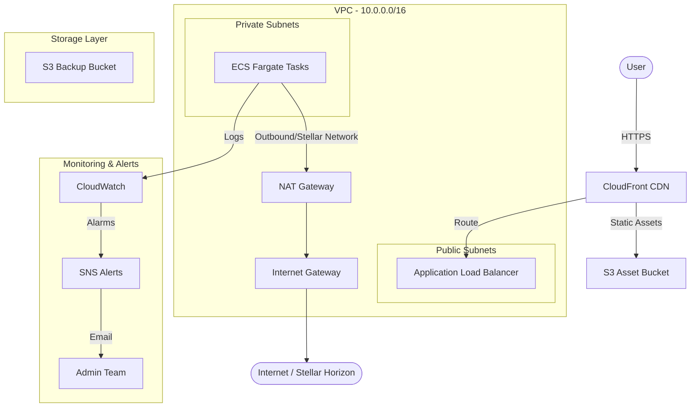

# StellarWork Cloud Infrastructure

This document outlines the cloud infrastructure architecture, deployment guidelines, and management practices for the StellarWork platform using Terraform.

## Architecture Overview

StellarWork's infrastructure is deployed on AWS and is designed for high availability, security, and scalability.



### Key Components

1. **Networking (VPC)**:
   - Isolated Virtual Private Cloud (VPC) with public and private subnets across multiple Availability Zones (AZs).
   - Public subnets host the Application Load Balancer (ALB).
   - Private subnets host the ECS Fargate tasks to ensure they are not directly exposed to the internet.
   - NAT Gateway provides secure outbound internet access for tasks in private subnets (e.g., to communicate with the Stellar Horizon API).

2. **Compute (ECS Fargate)**:
   - Serverless container orchestration using AWS ECS with Fargate.
   - Automatically scales Next.js frontend tasks across multiple AZs.
   - Traffic is distributed via the Application Load Balancer (ALB) with health checks.

3. **Storage (S3)**:
   - **Assets Bucket**: Hosts user uploads, media, and static assets. Configured with CORS for frontend access and AES256 server-side encryption.
   - **Backups Bucket**: Secure storage for database/state backups, configured with a lifecycle policy to automatically transition old files to Glacier after 30 days and permanently expire them after 90 days.

4. **Monitoring (CloudWatch & SNS)**:
   - Dashboard tracking CPU/Memory utilization and ALB request counts.
   - Alarms triggering email notifications via SNS when resource utilization exceeds 80%.

---

## Directory Structure

```text
terraform/
├── backend.tf                # S3 Remote State and DynamoDB Locking
├── providers.tf              # AWS and Random provider configurations
├── main.tf                   # Main orchestration file (instantiates modules)
├── variables.tf              # Global input variables
├── outputs.tf                # Global output variables
├── environments/             # Environment-specific variables
│   ├── dev/
│   │   └── terraform.tfvars
│   ├── staging/
│   │   └── terraform.tfvars
│   └── prod/
│       └── terraform.tfvars
└── modules/                  # Reusable infrastructure modules
    ├── networking/           # VPC, Subnets, SG, Route Tables
    ├── compute/              # ECS Cluster, Task Definitions, ALB
    ├── storage/              # S3 buckets (Assets, Backups)
    └── monitoring/           # CloudWatch Dashboards, Alarms, SNS
```

---

## Deployment Guide

### Prerequisites

- Terraform CLI (`>= 1.5.0`)
- AWS CLI configured with appropriate credentials
- An S3 bucket (`stellarwork-terraform-state`) and a DynamoDB table (`stellarwork-terraform-locks`) created for remote state.

### Local Deployment

1. **Initialize Terraform**:
   ```bash
   cd terraform
   terraform init
   ```

2. **Select or Create Workspace**:
   ```bash
   terraform workspace new dev
   # or
   terraform workspace select dev
   ```

3. **Plan the Deployment**:
   ```bash
   terraform plan -var-file="environments/dev/terraform.tfvars"
   ```

4. **Apply the Changes**:
   ```bash
   terraform apply -var-file="environments/dev/terraform.tfvars"
   ```

---

## CI/CD Pipeline

A GitHub Actions workflow is configured in `.github/workflows/terraform.yml`. It automates the validation and deployment process:

- **On Pull Requests to `main`**:
  - Validates formatting (`terraform fmt`)
  - Runs static analysis/validation (`terraform validate`)
  - Generates a plan against the `staging` environment and comments the output directly on the PR.
- **On Push/Merge to `main`**:
  - Automatically applies the plan to the `production` environment.

---

## Cost Estimation & Tagging Strategy

### Cost Optimization

- **Fargate Resource Allocation**: Development environments use minimal resources (`0.25 vCPU`, `0.5 GB RAM`) and a single task to minimize costs. Production scales to `3` tasks across different AZs.
- **S3 Lifecycle Policies**: Backups are transitioned to Glacier storage class after 30 days, reducing storage costs by up to 75%.
- **NAT Gateway**: A single NAT Gateway is shared across the VPC in non-production environments to save on hourly NAT fees.

### Tagging Strategy

Every resource provisioned by Terraform is tagged automatically using the `default_tags` provider block.

| Tag Key | Example Value | Description |
| :--- | :--- | :--- |
| `Project` | `StellarWork` | Name of the application/project |
| `Environment` | `dev` / `staging` / `prod` | Deployment stage |
| `ManagedBy` | `Terraform` | Identifies the resource manager |
